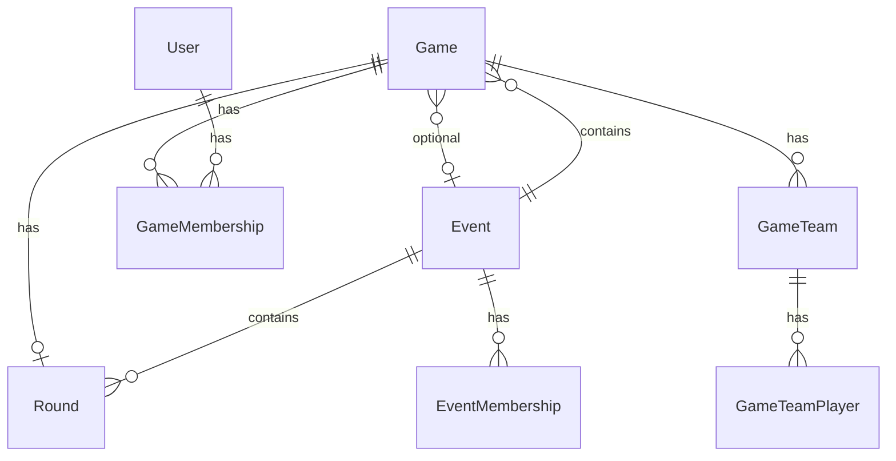

# Ad Hoc Games & Game-First On-Course — Design

**Date:** 2026-05-18  
**Status:** Approved pending review  
**Supersedes (partially):** [2026-05-06-on-course-games-design.md](2026-05-06-on-course-games-design.md) §2–4 (event-as-root assumptions)

---

## 1. Goal

Make **games** the primary On-Course object so users can set up and play a single round without creating an event/trip. **Events** remain as an optional wrapper for multi-game outings. Preserve existing team-checkbox behavior (event members are the picker pool; unchecked players sit out per game).

---

## 2. Decisions (locked)

| Topic | Decision |
|-------|----------|
| Model change | **Full target model** — nullable `event_id`, game token, top-level routes (no hidden event shell) |
| Scoring lock | Scores **always editable** until host completes the game; **Complete game** locks; **Edit scores** (host/cohost) reopens |
| Create flow | **Single wizard** (name → course/tee → format → invite → teams), **saveable** — user can stop mid-setup and return |
| Game name | **User-provided**, with auto-generated example in helper text (e.g. `40 Score · Pine Valley · May 18`) |
| Who can create | **Any signed-in user** |
| Invite | **Token link**, same pattern as pools/events (`/games/:token/join`) |
| Pre-team visibility | Joined players **can view** the game before team assignment |
| Events | **Separate** trip wrapper; UX centered on games |
| Promote ad hoc → event | **Not in scope** |
| Roles | **Host** / **cohost** on games (analogous to commissioner on events); cohosts can be promoted |
| Trip roster | Event membership = picker pool; **GameTeamPlayer** = actually playing (unchanged) |

---

## 3. Product overview

### 3.1 Navigation

- **On-Course** index lists **games** the user can access (primary).
- Secondary action: **Plan a trip** → creates an **Event** (existing flow, simplified over time).
- Sidebar contextual section: **This game** when viewing a game; **This event** when viewing an event.

### 3.2 Two creation paths

| Path | When | Result |
|------|------|--------|
| **New game** | Default; ad hoc round | `Game` with `event_id: null`, own token, `GameMembership` roster |
| **New game under event** | From event show page | `Game` with `event_id` set; roster pool = event members (today’s behavior) |

Both paths share the same wizard steps, scorecard, and team UI after the game record exists.

### 3.3 Game lifecycle

Three statuses on `Game`:

| Status | Meaning | Scoring |
|--------|---------|---------|
| **`draft`** | Setup in progress — missing round snapshot and/or `game_type`, or host has not finished initial save | Disabled |
| **`active`** | Round + format configured; play and score | **Editable** for team players and hosts |
| **`completed`** | Host used **Complete game** | **Locked** for players; hosts/cohosts use **Edit scores** to reopen → `active` |

**Draft persistence:** Saving any wizard step persists progress. A game stays `draft` until **both** a round snapshot (course/tee) and `game_type` are saved. Teams and invites can happen while `draft` or `active`; scoring requires `active` and a `GameTeamPlayer` row.

**Terminology:** Retire user-facing “submitted.” Replace DB column `submitted` with `status` enum (`draft`, `active`, `completed`) or map `completed` status to replace the boolean (see §5).

**Complete / reopen:**

- **Complete game** — any **host** or **cohost**; strong confirmation (`turbo_confirm`).
- **Edit scores** — host/cohost only; sets status back to `active` with confirmation.

Event `draft` / `active` / `completed` is unchanged and applies only to trips.

---

## 4. User flows

### 4.1 Ad hoc game (happy path)

1. User clicks **New game** on On-Course index.
2. **Step 1 — Name:** required; placeholder/helper shows suggested name from course/date once known.
3. **Step 2 — Course & tee:** GolfCourseAPI search + tee snapshot (creates/updates `Round`, `event_id: null`).
4. **Step 3 — Format:** `best_ball` or `forty_score`.
5. On save of steps 2+3 → status becomes **`active`** (if name present).
6. **Invite:** copy game link; players sign up / log in → **Join game** → `GameMembership` (`player`).
7. **Teams:** host assigns from joined members (checkbox UI); unchecked = sitting out.
8. **Score:** team players enter scores anytime while `active`.
9. **Complete game** when done; **Edit scores** if corrections needed later.

User may leave after any step; returning opens the wizard at the current step for `draft` games.

### 4.2 Event game (trip)

1. Commissioner creates event; members join via event invite (unchanged).
2. Commissioner creates **game under event** — same wizard, `event_id` preset.
3. Team picker lists **`event.users`** (unchanged); unchecked event members sit out.
4. Scoring, complete, reopen — same as ad hoc.

Event members who are not on a team can still **view** the game scorecard.

### 4.3 Join flows

| Game type | Join step |
|-----------|-----------|
| Ad hoc | `/games/:token/join` → `GameMembership` |
| Event | `/events/:token/join` → `EventMembership` (no separate per-game join) |

---

## 5. Domain model

### 5.1 Entity diagram



### 5.2 `Game` (changes)

**Add:**

| Column | Type | Notes |
|--------|------|-------|
| `token` | string, unique, not null | Invite URL; `to_param` |
| `creator_id` | FK users | Original host |
| `name` | string, not null | User-provided display name |
| `status` | string enum | `draft`, `active`, `completed` |

**Change:**

| Column | Change |
|--------|--------|
| `event_id` | **Nullable** — null for ad hoc |
| `submitted` | **Remove** — replaced by `status == completed` |

**Validations:**

- `game_type` required when leaving `draft` (transition to `active`).
- `round` required when leaving `draft`.
- If `event_id` present, `round.event_id` must match (or round belongs to same event).

**Associations:**

```ruby
belongs_to :event, optional: true
belongs_to :round
belongs_to :creator, class_name: "User"
has_many :game_memberships, dependent: :destroy
has_many :members, through: :game_memberships, source: :user
```

### 5.3 `Round` (changes)

| Column | Change |
|--------|--------|
| `event_id` | **Nullable** — null when round is ad hoc (owned only via game) |

Event rounds keep `event_id`. Ad hoc rounds have `event_id: null` and are referenced by exactly one game.

### 5.4 `GameMembership` (new)

| Column | Type | Notes |
|--------|------|-------|
| `game_id` | FK | |
| `user_id` | FK | |
| `role` | string | `host`, `cohost`, `player` |

- Unique `[game_id, user_id]`.
- Creator gets `host` on game create.
- Promote `player` → `cohost` (host/cohost only).
- **Ad hoc:** roster for team picker = `game.members`.
- **Event games:** team picker still uses `event.users`; `GameMembership` optional for event games in v1 (index visibility uses event membership). May add sync later; not required for launch.

### 5.5 Roles & authorization

| Action | Ad hoc | Event game |
|--------|--------|------------|
| View game | `GameMembership` or on a team | Event member |
| Setup wizard / teams | host, cohost | event commissioner |
| Enter scores | team player; host/cohost override | same |
| Complete / reopen | host, cohost | event commissioner (or host if we add game-level host on event games — **use commissioner for event games** to avoid dual role confusion) |

**Recommendation:** For event-scoped games, **commissioner** retains setup/complete/reopen powers. For ad hoc, **host/cohost** on `GameMembership`. Shared helper: `Game#can_manage?(user)`.

### 5.6 Sitting out

Unchanged: only checked users receive `GameTeamPlayer`. No `GameMembership` removal required to sit out.

---

## 6. Routes

```ruby
resources :games, param: :token do
  post :join, on: :member
  member do
    get  :edit_teams
    patch :update_teams
    patch :complete      # lock → status completed
    patch :reopen        # unlock → status active
  end
  resources :game_memberships, only: [:destroy, :update]
  resources :hole_scores, only: [:update]
end

# Wizard (nested under games or member routes)
resources :games, param: :token do
  resource :setup, only: [:show, :update], controller: "game_setups"
end

resources :events, param: :token do
  # Event CRUD unchanged
  resources :games, only: [:new, :create]  # creates game with event_id
  resources :rounds, only: [:new, :create]   # event rounds (unchanged)
end

# On-Course home
get "on_course", to: "games#index", as: :on_course  # or root of games#index
```

Migrate existing nested routes `/events/:token/games/:id` → redirect to `/games/:game_token` for bookmarks.

---

## 7. On-Course index

**Query:** games where user:

- has `GameMembership`, **or**
- has `GameTeamPlayer` on the game, **or**
- is member of the game’s event (when `event_id` present)

**Sort:** `played_on` desc (from round), then `created_at` desc.

**Row display:**

- Game name (user-provided)
- Format · course · date
- Status badge: Draft / Scoring / Completed
- Optional subtitle: `Part of {Event name}`

**Actions:** New game · Plan a trip (new event)

---

## 8. UI notes

### 8.1 Wizard

- Multi-step form with explicit **Save & continue later** (each step persists).
- Show progress indicator (Name → Course → Format → Invite → Teams).
- Draft games appear on index with **Continue setup** CTA.

### 8.2 Game show page

- Scorecard when teams exist and status is `active` or `completed`.
- Pre-team state: member list, “Waiting for teams” for joined players, **Set up teams** for host.
- **Complete game** button when `active` and at least one score exists (optional guard).
- **Edit scores** when `completed` (host/cohost or commissioner).

### 8.3 Naming helper

Suggest: `"#{game_type.titleize} · #{course_name} · #{played_on.strftime('%-b %-d')}"`  
Show under name field once course/date known.

---

## 9. Migration plan

1. Add `games.token`, `games.creator_id`, `games.name`, `games.status`.
2. Backfill existing games: generate tokens; `name` from round name + game type; `creator_id` from first event commissioner; map `submitted: true` → `completed`, else `active`.
3. Make `games.event_id` nullable.
4. Make `rounds.event_id` nullable (no ad hoc rounds yet; existing rows keep event_id).
5. Create `game_memberships`; backfill ad hoc not needed (all existing games have events).
6. Drop `games.submitted`.
7. Add redirects from old event-nested game URLs.

---

## 10. Out of scope

- Promote ad hoc game to event game
- Per-game join for event games
- Real-time score sync
- `GameMembership` sync from event join
- Game deletion / archive

---

## 11. Testing focus

- Ad hoc wizard: partial save, resume, draft → active transition
- Join via game token; view before team assignment
- Team checkbox sit-out behavior (unchanged specs, new roster source for ad hoc)
- Complete / reopen authorization
- Event game regression: commissioner flow, event member picker
- Index includes ad hoc and event games
- Nullable FK integrity (ad hoc round + game, event game + round)

---

## 12. Follow-up

After approval: invoke **writing-plans** skill for implementation plan (`2026-05-18-ad-hoc-games-plan.md`).

Update [2026-05-06-on-course-games-design.md](2026-05-06-on-course-games-design.md) with a short § amendment pointing here for game-first and ad hoc behavior.
